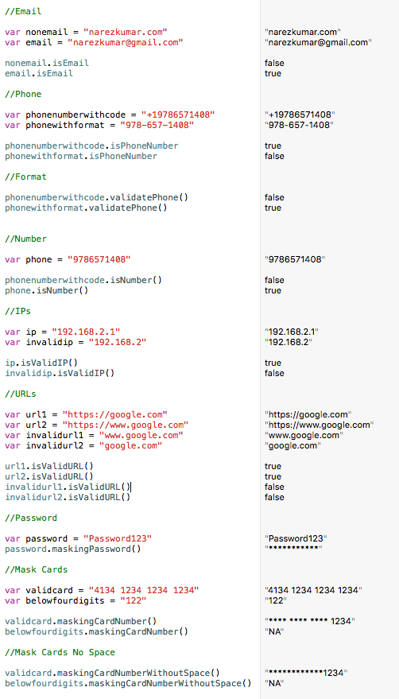
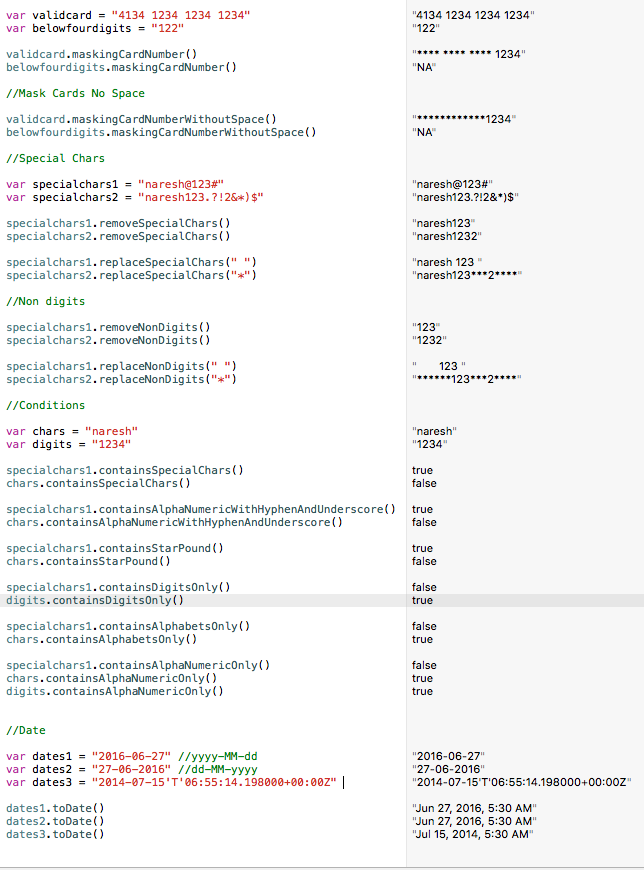

##NKStringUtils

NKStringUtils string utils classes for iOS Swift Projects

###Compatibility

NKStringUtils requires iOS8+, compatible with both Swift 2/3

###Screenshots





## Installation

NKStringUtils is available through [CocoaPods](http://cocoapods.org). To install
it, simply add the following line to your Podfile:

```ruby
pod "NKStringUtils"
```

## Author

Naresh Kumar, narezkumar@gmail.com

## License

NKStringUtils is available under the MIT license. See the LICENSE file for more info.
